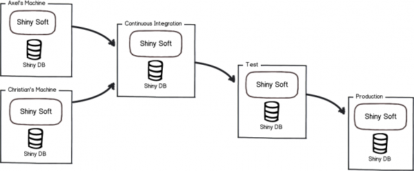

# 어떻게 하면 `flyway`를 잘 사용할 수 있을까?

회사에서 `flyway`를 사용하게 된 계기부터 사용하며 마주친 문제들, 그것을 해결해가는 과정에 대해 정리해보려 합니다.

- `flyway`란?
- `flyway`를 사용한 이유
- `flyway`를 사용하며 마주친 문제점
- `flyway`문제 해결 과정

---

## `flyway`란?

`flyway`는 강력한 규칙을 기반으로 단순하게 데이터베이스 마이그레이션을 할 수 있는 오픈소스 툴입니다.

데이터베이스 마이그레이션 툴이 필요한 이유는 많은 프로젝트들이 다중 분산 제어 환경에 있기 때문입니다.



동작 방식이나 사용 방법은 Document에 잘 정리되어 있으므로 여기서는 사이트만 소개하겠습니다.

- [flyway Document](https://flywaydb.org/documentation/)


---

## `flyway`를 사용한 이유

우리 팀은 배포하는 과정에서 DB 수정사항에 대해 문서를 관리하고 배포를 하기 전후로 수기로 적용을 하고 있었습니다.

그러다보니 문서 관리에 시간을 뺐기고, 휴먼 에러로 인해 반영되어야 할 DB 수정사항을 놓치는 경우가 간혹 발생했습니다. 

이런 문제들이 반복되고 DB를 관리해줄 툴에 대한 필요성을 느꼈고, `flyway`를 사용하게 되었습니다.  

---

## `flyway`를 사용하며 마주친 문제점
우리 팀은 버전 관리를 위해 `Git`을 사용합니다. 워크플로는 메인 브랜치에서 새로운 브랜치를 생성하고, 생성한 브랜치에서 기능 구현 및 테스트를 끝낸 다음 해당 브랜치를 다시 메인 브랜치에 병합하는 방식입니다.
이런 워크플로에서 `flyway`를 사용하며 생겼던 문제에 대해 우선 말하려 합니다.


회사에서 새로운 개발 일정이 나왔고 그 기능들을 `챗봇`과 `추천 콘텐츠`라고 예시를 들겠습니다. 이 두 개의 기능은 각각 A, B 개발자에게 맡겨졌고 둘은 브랜치를 생성하여 일정을 시작하게 됐습니다.
개발을 끝낸 A가 프론트와 연동을 하여 테스트를 하기 위해 배포를 하는 과정에 문제가 생깁니다. 

바로 챗봇 기능을 추가하기 위해 생성했던 sql이 반영이 안되는 문제인데요.

**현재 상황** 
- 메인 브랜치 `V1__baseLine`  
  - A 개발자가 챗봇에서 생성한 `V__1.0.1_add_chatbot_table.sql` 
    - 후반영
  - B 개발자가 추천 콘텐츠에서 생성한 `V__1.0.1_add_recommend_content_table.sql` 
    - 선반영 

B의 추천 콘텐츠 기능 개발에 대한 상황을 몰랐던 A는 B와 동일한 버전 넘버를 만들고 배포를 하여 실패하게 된 것입니다.

이렇게 배포 도중 애플리케이션에서 flyway 유효성에 실패한 경우 애플리케이션이 종료된 상태가 되는데 이로 인해 또 다른 문제가 생기고 해결하는 과정에서 `flyway_schema_history` 테이블 이력을 건드리고, sql 파일명을 고치는 등.. 많은 시간을 뻈기게 됩니다.  


---

## `flyway`문제 해결 과정

### 1. 버전 충돌 방지, 접두사(Prefix)를 정수가 아닌 타임스탬프를 사용 

`flyway`를 통해 반영할 `sql`의 접두사로 많은 분들이 정수 값을 사용하고 있는것 같은데요. 저희도 도입 당시에 아무 생각없이 increment한 정수 값을 사용하고 있었습니다. 
그러다보니 잦은 버전 충돌이 일어났고 sql파일 이름을 수정하는 일이 빈번했는데요.

이런 문제를 해결하기 위해 접두사를 정수가 아닌 타임스탬프를 사용하기로 하였습니다.

- 202210211845__add_chatbot_table.sql
- 202210211843__add_recommend_content_table.sql
- 202210211854__add_history_table_with_reference_to_chatbot_table.sql

단순히 정수를 타임스탬프로 바꾸는 것으로 서로 다른 개발자가 같은 이름의 sql을 생성할 일을 확 줄일 수 있었습니다.

### 2. 버전 순차처리 옵션 OFF

`flyway`의 기본 버전 처리 순서는 순차적인 처리 방식입니다. 이 순차처리 방식을 사용할 경우 최신 버전이 적용되고 나면 이전 버전이 반영이 될 것을 보장 못하는데요.

이런 상황을 해결하기 위해 flyway v2 에서 비순차처리 옵션 `out-of-order` 속성이 추가됐습니다.

```yaml
spring:
  flyway:
    out-of-order: false
```

### 3. 멱등성 있는 쿼리를 작성할 것 

멱등성 있는 쿼리는 우리에게 발생할 문제를 사전에 방지할 수 있습니다.

```mysql
-- 스키마 생성에 대한 체크
CREATE DATABASE IF NOT EXISTS `test`;
USE `test`;

-- 테이블 생성에 대한 체크
CREATE TABLE IF NOT EXISTS `tb_test` (
   `id` int(11) NOT NULL auto_increment,
   PRIMARY KEY  (`id`)
);
```

이렇게 멱등성을 가진 쿼리를 작성하고, 언급했던 규칙을 따르더라도 언제든 다른 문제가 발생할 수 있습니다.

다만, 우리 팀은 이런 규칙을 통해 `flyway`를 사용하며 발생했던 많은 문제를 해결할 수 있었고 또 다른 문제가 생기면 그것을 해결할 방법을 찾을 것 입니다.   