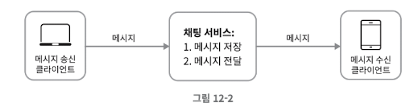

# 가상면접 사례로 배우는 대규모 시스템 설계 기초, 채팅 시스템 설계

# 채팅 시스템 설계

채팅 앱은 여러가지 종류가 있다.

- 1:1 채팅에 중점을 두는 소통용 앱 라인, 카카오톡
- 그룹 채팅에 중점을 둔 업무용 앱 슬랙
- 게임 채팅에 중점을 둔 대규모 그룹 채팅 앱 (응답 지연이 낮아야 함) 디스코드

## 1단계. 문제 이해 및 설계 범위 확정

**채팅 앱은 여러가지 종류가 있기 때문에 면접관이 원하는 앱이 정확히 무엇인지 알아내야 한다. 적어도 1:1 채팅 앱인지 아니면 그룹 채팅 앱인지 정도는 알아야 한다.**

- 1:1 채팅과 그룹 채팅을 둘 다 지원
- 모바일 앱과 웹 앱에 대한 지원
- 일별 능동 사용자 수 (DAU: Daily Active User) 기준으로 5천만 명을 처리해야 함
- 그룹 채팅은 최대 100명까지 참가 가능
- 1:1 채팅, 그룹 채팅, 사용자의 접속 상태를 표시하는 기능이 필요
- 메시지 최대 길이는 100,000자 이하
- 채팅 이력은 영원히 보관

이번 채팅 시스템은 페이스북 메신저와 유사한 채팅 앱을 설계한다. 이 앱은 다음과 같은 기능을 갖는다.

- 응답지연이 낮은 일대일 채팅 기능
- 최대 100명까지 참여할 수 있는 그룹 채팅 기능
- 사용자의 접속상태 표시 기능
- 다양한 단말 지원. 하나의 계정으로 여러 단말 동시 접속 지원
- 푸시 알림
- 5천만 DAU를 처리

## 2단계. 개략적 설계안 제시 및 동의 구하기

채팅 앱을 잘 설계하기 위해서는 클라이언트와 서버의 통신 방법에 대한 기본적 지식은 갖추고 있어야 한다. 

- 채팅 시스템의 클라이언트는 모바일 앱이거나 웹 애플리케이션이다.
- 클라이언트는 서로 직접 통신하지 않고 채팅 서비스와 통신 한다.

**기본 기능**

- 클라이언트들로부터 메시지 수신
- 메시지 수신자(recipient) 결정 및 전달
- 수신자가 접속(online) 상태가 아닌 경우에는 접속할 때까지 해당 메시지 보관

메시지 송신 클라이언트와 수신 클라이언트의 채팅 서비스 사이의 관계(MQTT, pub/sub)

**채팅을 시작하려는 클라이언트는 네트워크 통신을 통해 서비스에 접속한다. 따라서 채팅 서비스의 경우 어떤 통신 프로토콜을 사용할 것인가도 중요한 문제이다.**

- 메시지 송신 클라이언트가 수신 클라이언트에게 전달할 메시지를 채팅 서비스에 보낼 때 HTTP 사용
- 클라이언트는 채팅 서비스에 HTTP 프로토콜로 연결한 다음 메시지를 수신자에게 전달하라고 알림
- 채팅 서비스와의 접속에는 keep-alive 헤더를 사용
    - 클라이언트와 서버 사이의 연결을 유지
    - TCP 접속 과정에서 3-way handshake 횟수를 줄임
    - 롱 폴링 방식

하지만 HTTP는 클라이언트가 연결을 만드는 프로토콜이며, **서버에서 클라이언트로 임의 시점에 메시지를 보내는 데는 쉽게 쓰일 수 없기 때문에** 많은 기법이 제안되어 왔는데 *폴링(polling), 롱 폴링(long-polling), 웹 소켓(WebSocket)* 등이 그런 기술이다.

