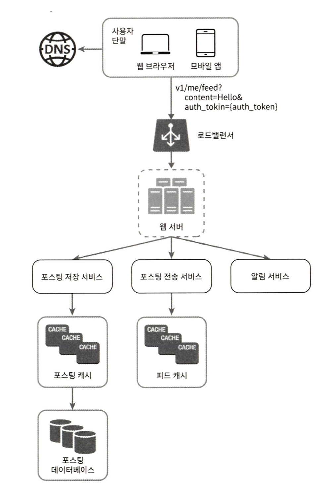

# 가상면접 사례로 배우는 대규모 시스템 설계 기초, 뉴스 피드 시스템 설계

# 뉴스 피드 시스템 설계

**뉴스 피드란?**

> “페이스북의 도움말 페이지는, 뉴스 피드는 여러분의 홈 페이지 중앙에 지속적으로 업데이트되는 스토리들로, 사용자 상태 정보 업데이트, 사진, 비디오, 링크, 앱 활동, 그리고 여러분이 페이스북에 팔로하는 사람들, 페이지, 또는 그룹으로부터 나오는 ‘좋아요’ 등을 포함한다” 고 설명한다.
> 

뉴스 피드는 아주 유명한 면접 문제이고 피드 시스템 종류로 페이스북, 트위터 타임라인, 인스타그램 피드 등이 있다.

## 1단계. 문제 이해 및 설계 범위 확정

**뉴스 피드 시스템을 설계하라고 했을 때 면접관의 의도를 질문을 통해 분명히 파악해야 한다. 최소한 어떤 기능을 지원해야 할지는 반드피 파악해야 한다.**

- 웹, 모바일에 대한 지원이 필요
- 사용자는 뉴스 피드 페이지에 새로운 스토리를 올릴 수 있어야 하고 (**피드 발행**), 친구들이 올리는 스토리를 볼 수도 있어야 함 (**뉴스 피드 생성, 피드 읽기**)
- 뉴스 피드 정렬은 시간 흐름 역순으로 표시
- 한 명의 사용자는 최대 5,000명의 친구 목록을 가짐
- 하루 평균 천만 명 방문자
- 스토리에는 이미지나 비디오 등의 미디어 파일도 포함

## 2단계. 개략적 설계안 제시 및 동의 구하기

설계안은 **피드 발행(feed publishing)**과 **뉴스 피드 생성(news feed building)**의 두 가지 부분으로 나눌 수 있다.

## **뉴스 피드 API**

- 클라이언트가 서버와 통신하기 위해 사용하는 수단
- HTTP 프로토콜 기반 (웹, 모바일 지원)
- 상태 정보를 업데이트, 뉴스 피드 가져오기, 친구 추가 등..

### 피드 발행

<aside>
💡 사용자가 스토리를 포스팅하면 해당 데이터를 캐시와 데이터베이스에 기록한다. 새 포스팅은 친구의 뉴스 피드에도 전송(뉴스 피드 생성)된다.

</aside>



```markdown
### 피드 발행 API(새 스토리를 포스팅하기 위한 API)
POST /v1/me/feed
Content-Type: application/json
Authorization: ${인증 토큰}

{ 포스팅 내용 }
```

- 사용자 : 모바일 앱이나 브라우저에서 새 포스팅을 올리는 주체
    - `POST /v1/me/feed` API를 사용
- 로드밸런서 : 트래픽을 웹 서버들로 분산
- 웹 서버 : HTTP 요청을 내부 서비스로 중계하는 역할
- 포스팅 저장 서비스(post service) : 새 포스팅을 캐시와 데이터베이스에 저장
- 포스팅 전송 서비스(fanout service) : 새 포스팅을 친구의 뉴스피드에 푸시(push), 뉴스 피드 데이터는 캐시에 보관
- 알림 서비스 (notification service) : 친구들에게 새 포스팅을 알리거나, 푸시 알림을 보내는 역할

### 뉴스 피드 생성

<aside>
💡 지면 관계상 뉴스 피드는 모든 친구의 포스팅을 시간 흐름 역순으로 모아서 만든다고 가정한다.

</aside>


```markdown
### 피드 읽기 API (뉴스 피드를 가져오는 API)
GET /v1/me/feed
Authorization: ${인증 토큰}
```

- 사용자 : 뉴스 피드를 읽는 주체
    - `GET /v1/me/feed` API를 사용
- 로드밸런서 : 트래픽을 웹 서버들로 분산
- 웹 서버 : 트래픽을 뉴스 피드 서비스로 보냄
- 뉴스 피드 서비스(news feed service) : 캐시에서 뉴스 피드를 가져옴
- 뉴스 피드 캐시(news feed cache) : 뉴스 피드를 렌더링할 때 필요한 피드 ID를 보관

## 3단계. 상세 설계

### **피드 발행 흐름 및 상세 설계**

웹 서버와 포스팅 전송 서비스(fanout service)에 초점을 맞추었다.


### **웹 서버**

- 클라이언트와 통신
- 인증
    - 인증 토큰을 헤더에 넣고 API 호출
- 처리율 제한
    - 스팸 차단
    - 유해 콘텐츠 차단

### **포스팅 전송(팬아웃) 서비스**

- 포스팅 전송, 즉 팬아웃(fanout)
    - 작성자의 새 포스팅을 작성자와 친구 관계를 가진 모든 사용자에게 전달하는 과정
- 팬아웃의 모델
    - 쓰기 시점에 팬아웃(fanout-on-write), 푸시 모델
    - 읽기 시점에 팬아웃(fanout-on-read), 풀 모델

### 쓰기 시점에 팬아웃하는 푸시 모델 동작 원리

새로운 포스팅을 기록하는 시점에 뉴스 피드 갱신하고, 포스팅이 완료되면 바로 해당 사용자의 캐시에 해당 포스팅을 기록

**장점**

- 뉴스 피드가 실시간으로 갱신되며 친구 목록에 있는 사용자에게 즉시 전송
- 새 포스팅이 기록되는 순간에 뉴스 피드가 이미 갱신되므로 (pre-computed) 뉴스 피드를 읽는 데 드는 시간이 짧아짐

**단점**

- 친구가 많은 사용자의 경우 친구 목록을 가져오고 그 목록에 있는 사용자 모두의 뉴스 피드를 갱신하는 데 많은 시간이 소요될 수 있다.
    - 핫키(hotkey) 라고 부르는 문제가 존재
- 서비스를 자주 이용하지 않는 사용자의 피드까지 갱신해야 하므로 컴퓨팅 자원이 낭비된다.

### 읽기 시점에 팬아웃하는 풀 모델 동작 원리

피드를 읽어야 하는 시점에 뉴스 피드를 갱신한다. 따라서 요청 기반 (on-demand) 모델이다. 사용자가 본인 홈페이지나 타임라인은 로딩하는 시점에 새로운 포스트를 가져오게 된다.

**장점**

- 비활성화된 사용자, 또는 서비스에 거의 로그인하지 않는 사용자의 경우에는 이 모델이 유리하다.
    - 로그인하기 전까지는 컴퓨팅 자원을 소모하지 않음
- 데이터를 친구 각각에 푸시하는 작업이 필요 없으므로 핫키 문제도 생기지 않는다.

**단점**

- 뉴스 피드를 읽는데 많은 시간이 소요될 수 있다.

### **두가지 방법을 결합한 모델**

- 뉴스 피드를 빠르게 가져오는 것은 아주 중요하므로, 대부분의 사용자는 푸시 모델을 사용
- 친구나 팔로워가 아주 많은 사용자의 경우에는 팔로워로 하여금 해당 사용자의 포스팅을 필요할 때 가져가도록 풀 모델 사용
    - 시스템 과부하 방지
- 안정 해시(consistent hashing)를 통해 요청과 데이터를 보다 고르게 분산하여 핫키 문제를 줄임


**팬아웃 서비스 동작 과정**

1. 그래프 DB에서 친구 ID 목록을 가져온다.
    - 그래프 데이터베이스는 친구 관계나 친구 추천을 관리하기 적합
2. 사용자 정보 캐시에서 친구들의 정보를 가져온다. 그런 후에 사용자 설정에 따라 친구 가운데 일부를 걸러낸다. 
    - mute
    - 일부 사용자에게만 스토리 공개
3. 친구 목록과 새 스토리의 포스팅 ID를 메시지 큐에 넣는다.
4. 팬아웃 작업 서버가 메시지 큐에서 데이터를 꺼내어 뉴스피드 데이터를 뉴스 피드 캐시에 넣는다. 
    - 뉴스 피드 캐시는 <포스팅 ID, 사용자 ID> 의 순서쌍을 보관
        - 메모리 요구량을 줄이기 위해 ID만 보관
    - 뉴스 피드 캐시에는 크기 제한을 두며, 해당 값은 조정 가능하도록 둔다.
    - 대부분 사용자는 최신 스토리만 보기에, 캐시 미스가 일어날 확률은 낮다.

### **피드 읽기 흐름 상세 설계**


1. 이미지나 비디오 같은 미디어 콘텐츠를 CDN에 저장하여 빨리 읽어갈 수 있도록 함
2. 사용자가 뉴스 피드를 읽으려는 요청을 보냄
    - 요청은 `GET /v1/me/feed` 전송
3. 로드밸런서가 요청을 웹 서버 가운데 하나로 보낸다.
4. 웹 서버는 피드를 가져오기 위해 뉴스 피드 서비스를 호출한다.
5. 뉴스 피드 서비스는 뉴스 피드 캐시에서 포스팅 ID 목록을 가져온다.
6. 뉴스 피드에서 표시할 사용자 이름, 사용자 사진, 포스팅 콘텐츠, 이미지 등을 사용자 캐시와 포스팅 캐시에서 가져와 완전한 뉴스 피드를 만든다.
7. 생성된 뉴스 피드를 JSON 형태로 클라이언트에게 보내고 클라이언트는 해당 피드를 렌더링 한다.

### **캐시 구조**

캐시는 뉴스 피드 시스템의 핵심 컴포넌트다. 본 설계안에선 캐시를 5 계층으로 나눈다.


- 뉴스 피드 : 뉴스 피드의 ID를 보관한다.
- 콘텐츠 : 포스팅 데이터를 보관한다.
    - 인기 콘텐츠는 따로 보관한다.
- 소셜 그래프 : 사용자 간 관계 정보를 보관한다.
- 행동(action) : 포스팅에 대한 사용자의 행위에 관한 정보를 보관한다.
    - 포스팅에 대한 좋아요, 답글 등
- 횟수 (counter) : 좋아요 횟수, 응답 수, 팔로어 수, 팔로잉 수 등의 정보 보관한다.

## **4단계. 마무리**

시스템 설계 면접은 정답이 없다. 어떤 trade-off가 있었는지 잘 이해하고 설명할 수 있어야 한다. 설계를 마친 후에도 시간이 남는다면 면접관과 규모 확장성 이슈를 논의하는 것도 좋다.

**데이터베이스 규모 확장**

- 수직적 규모 확장 vs 수평적 규모 확장
- SQL vs NoSQL
- 주-부(master-slave) 다중화
- 복제본(replica)에 대한 읽기 연산
- 일관성 모델(consistency model)
- 데이터베이스 샤딩(sharding)

**이 외에 논의해 볼만한 주제**

- 웹 계층(web tier)을 무상태로 운영하기
- 가능한 한 많은 데이터를 캐시할 방법
- 여러 데이터 센터를 지원할 방법
- 메시지 큐를 사용하여 컴포넌트 사이의 결합도 낮추기
- 핵심 메트릭(key metric)에 대한 모니터링.
    - 트래픽이 몰리는 시간대 QPS(Queries per Second)
    - 사용자가 뉴스 피드를 새로고침(refresh) 할 때의 지연 시간


### Reference
- 가상 면접 사례로 배우는 대규모 시스템 설꼐 기초